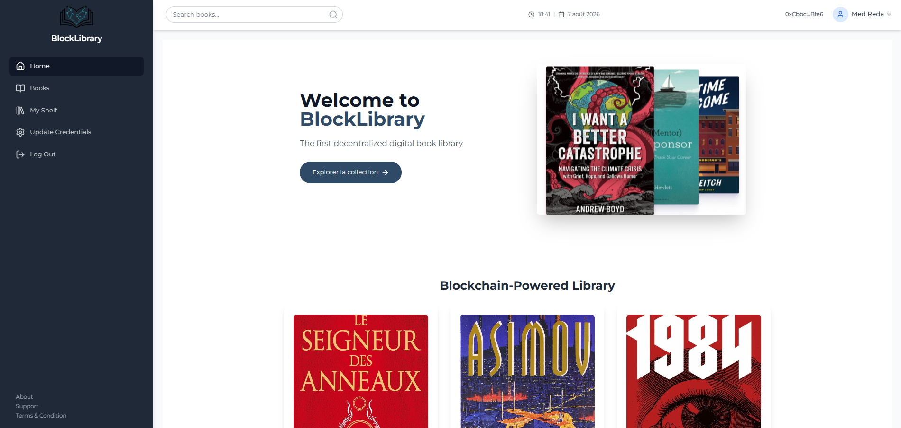
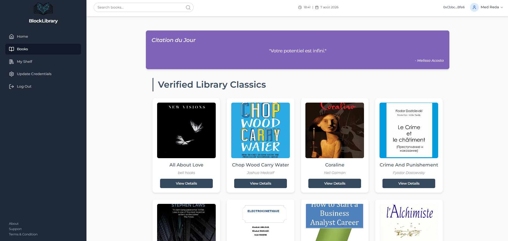
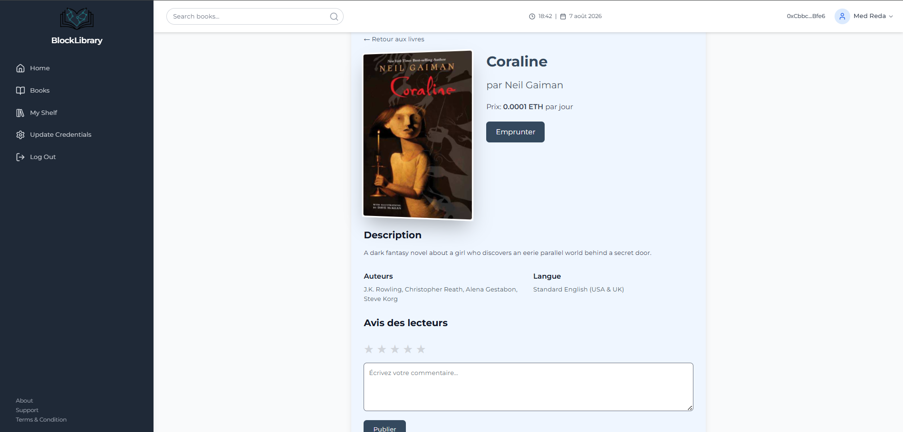
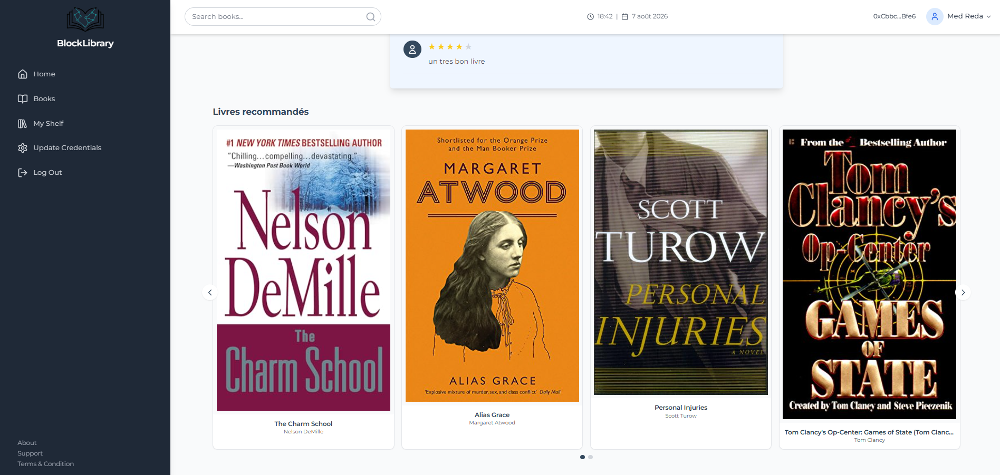
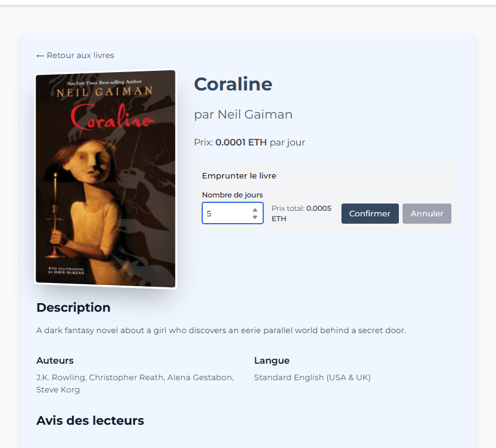
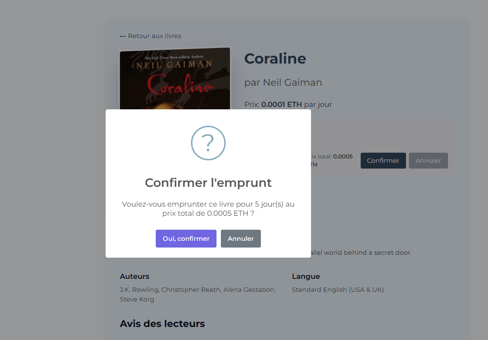
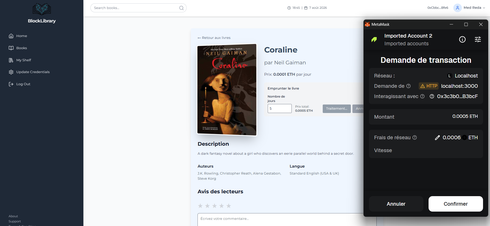
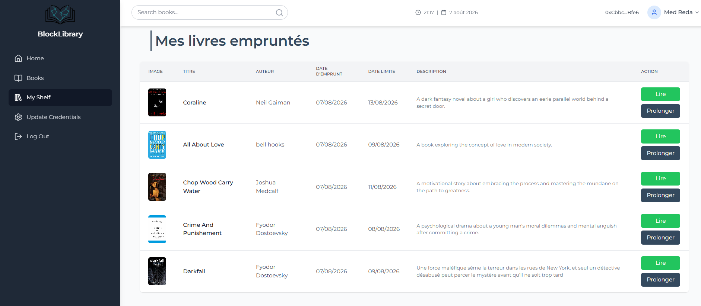
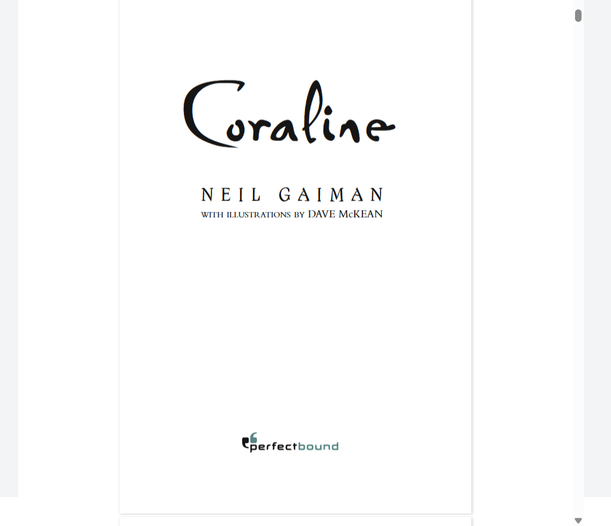
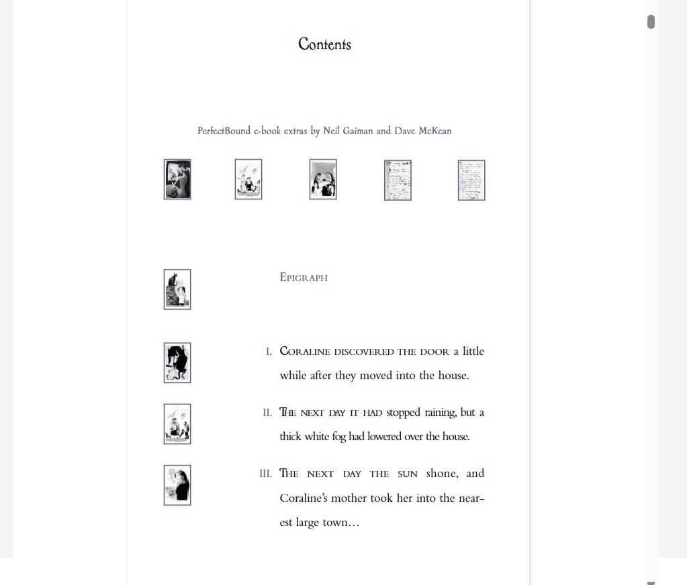

# BlockLibrary 📚🔗

BlockLibrary est une bibliothèque numérique décentralisée innovante qui combine le Web3, le stockage IPFS, et l'Intelligence Artificielle pour offrir une expérience de lecture et de location de livres (PDF) sécurisée, transparente et intelligente.

---

## 🎥 Visite Guidée de l'Application

Voici un aperçu complet des fonctionnalités de l'application :

### 1. Page d'Accueil (Explorer les Livres)
Les lecteurs peuvent parcourir l'ensemble de la bibliothèque disponible, voir les prix de location et découvrir de nouveaux ouvrages.

### 2. Le Catalogue de Livres (Books Page)
Une vue détaillée de tous les ouvrages stockés de manière décentralisée avec leur couverture.

### 3. Page de Détails d'un Livre
Informations complètes sur le livre sélectionné, avec la possibilité d'emprunter, et la section des avis de la communauté.

### 4. Recommandations par Intelligence Artificielle
Grâce à une API Python dédiée, l'application analyse le contexte et suggère automatiquement des ouvrages pertinents au lecteur.

### 5. Emprunter un Livre (Web3)
Processus simple pour définir la durée d'emprunt souhaitée. Le prix est calculé automatiquement en cryptomonnaie (ETH).

### 6. Validation de la Transaction (MetaMask)
Le paiement et l'enregistrement de l'emprunt sur la blockchain Ethereum (Smart Contracts) sont garantis et sécurisés via MetaMask.

### 7. Mon Étagère (My Shelf)
Un tableau de bord personnel permettant de gérer ses livres empruntés, voir les dates d'échéance, et prolonger ses emprunts en un clic.

### 8. Lecteur PDF Intégré (Sécurisé via IPFS)
Un lecteur de PDF complet directement intégré au navigateur pour une expérience de lecture fluide, tout en s'assurant que l'utilisateur possède les droits d'accès.

---

## 🚀 Fonctionnalités Principales

*   **Contrats Intelligents (Smart Contracts)** : Gestion sécurisée des livres, des emprunts et des durées de location via Ethereum (Solidity).
*   **Stockage Décentralisé (IPFS/Pinata)** : Les fichiers PDF et les métadonnées des livres sont stockés sur IPFS, garantissant qu'ils ne peuvent pas être supprimés ou censurés. Un système de proxy (gateways) assure une haute disponibilité.
*   **Emprunt & Prolongation** : Les utilisateurs peuvent louer des livres pour une durée définie, payer en cryptomonnaie (ETH) et prolonger leur durée de lecture facilement depuis leur tableau de bord.
*   **Recommandations par IA** : Une API Python utilisant des technologies d'Intelligence Artificielle analyse vos lectures pour vous recommander d'autres livres similaires.
*   **Système d'Avis (Reviews)** : Les lecteurs peuvent laisser des notes et des avis sur les livres qu'ils ont empruntés.

## 🛠️ Stack Technique

*   **Frontend** : React.js, TailwindCSS, Web3.js, React-PDF-Viewer.
*   **Backend** : Node.js, Express.js, Mongoose (MongoDB).
*   **Intelligence Artificielle** : API Python (FastAPI / Uvicorn).
*   **Blockchain** : Solidity, Truffle/Hardhat, Ganache (Local Testnet), MetaMask.
*   **Stockage** : IPFS (via Pinata API).

---

## ⚖️ Licence & Droits d'auteur

Copyright (c) 2026 - Tous droits réservés.
Toute reproduction, modification, distribution ou utilisation de ce code sans l'autorisation explicite de l'auteur est strictement interdite.